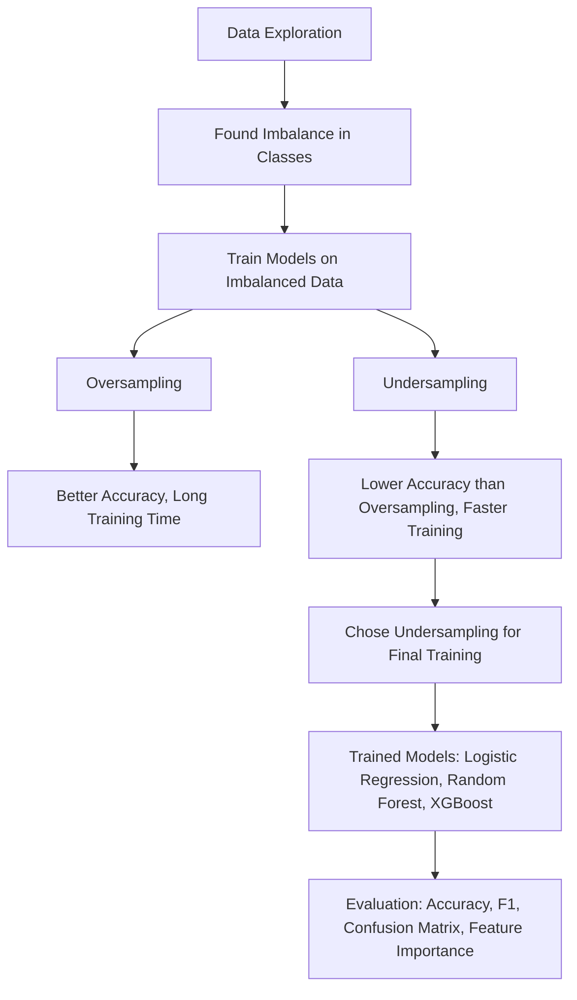
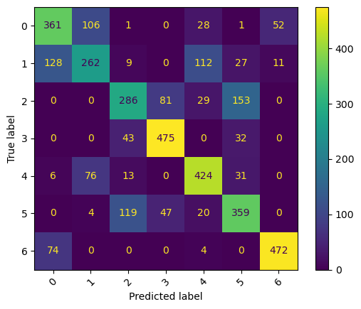
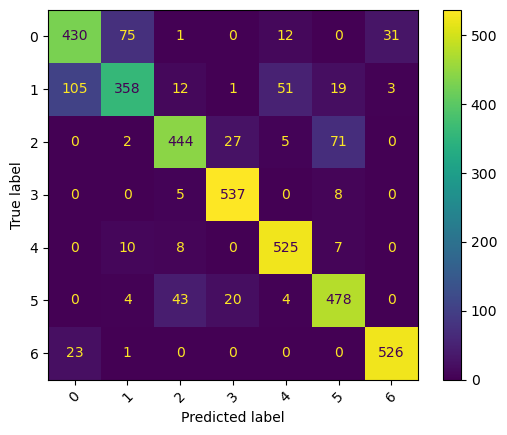

# Forest Cover Type Classification

## Project Overview
The goal of this project is to predict the type of forest cover (7 classes) from cartographic and environmental features. The dataset is the Covertype dataset from the UCI Machine Learning Repository.

Tasks completed:
- Data loading and exploration

- Preprocessing and handling imbalance

- Model training and evaluation (Logistic Regression, Decision Tree, Random Forest, XGBoost)

- Visualization of confusion matrix and feature importance

- Comparison of models and conclusions

## Dataset
- Source: UCI Machine Learning Repository – Covertype dataset

- Size: 581,012 samples, 54 features, 1 target

- Target: Cover_Type (7 forest categories)

- Distribution: Highly imbalanced (2 classes dominate)

## Workflow

## Models Trained 
- Logistic Regression: 
Accuracy: 68.61%, kinda small accuracy because of the low data after resampling.

- Random Forest Classifier
Accuracy: 85.75%, way better than logistic regression.

- XGBoost
Accuracy: 86.5%, best model of the 3.

## Evaluation
- Metrics used: Accuracy, Precision, Recall, F1-score

- Confusion Matrices plotted for eeach model

- Random Forest and XGBoost showed the best balanced preformance

## Conclusion
- Tree-based models performed significantly better than Logistic Regression.

- XGBoost achieved the highest accuracy, but Random Forest offered competitive results with better handling of class imbalance.

- Feature importance analysis highlighted elevation, aspect, and soil types as strong predictors.

- Future improvements could include hyperparameter tuning, advanced resampling (SMOTE), and testing boosting ensembles like LightGBM or CatBoost.